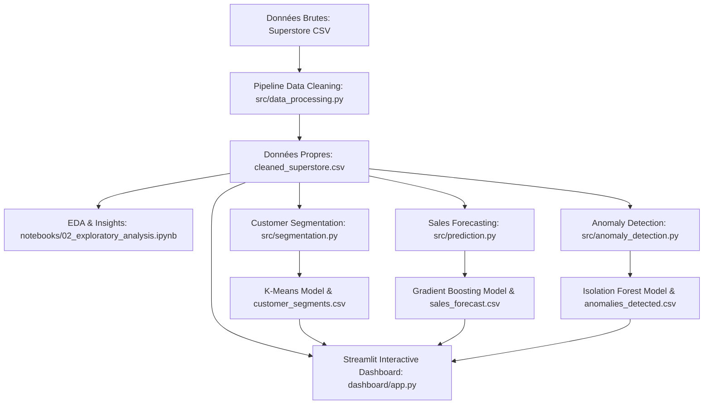

# 📊 Smart Business Intelligence & Sales Analytics Platform

[](https://www.python.org/)
[](https://streamlit.io/)
[](https://scikit-learn.org/)
[](https://plotly.com/)
[](LICENSE)

Une plateforme décisionnelle et d'analytique prédictive de bout en bout conçue pour permettre aux entreprises d'analyser leurs ventes, segmenter leur portefeuille clients, prévoir leurs revenus futurs et détecter automatiquement les anomalies financières.

**Auteur :** [Chaima Debchi](https://github.com/Chaimadebchi)  
**Dépôt GitHub :** [smart-business-intelligence](https://github.com/Chaimadebchi/smart-business-intelligence)

---

## 📌 Sommaire
- [1. Problématique Métier & Objectifs](#1-problématique-métier--objectifs)
- [2. Architecture du Projet](#2-architecture-du-projet)
- [3. Technologies Utilisées](#3-technologies-utilisées)
- [4. Dataset & Ingestion](#4-dataset--ingestion)
- [5. Pipeline de Nettoyage (Data Cleaning)](#5-pipeline-de-nettoyage-data-cleaning)
- [6. Analyse Exploratoire (EDA) & Découvertes Clés](#6-analyse-exploratoire-eda--découvertes-clés)
- [7. Machine Learning & Modélisation](#7-machine-learning--modélisation)
  - [Segmentation Client (K-Means & RFM)](#-segmentation-client-k-means--rfm)
  - [Prédiction des Ventes (Gradient Boosting)](#-prédiction-des-ventes-gradient-boosting)
  - [Détection des Anomalies (Isolation Forest)](#-détection-des-anomalies-isolation-forest)
- [8. Application Interactive Streamlit](#8-application-interactive-streamlit)
- [9. Arborescence du Code](#9-arborescence-du-code)
- [10. Guide d'Installation & Utilisation](#10-guide-dinstallation--utilisation)
- [11. Valorisation CV & LinkedIn](#11-valorisation-cv--linkedin)

---

## 1. Problématique Métier & Objectifs

Dans le secteur du commerce et de la distribution B2B/B2C, les entreprises sont confrontées à quatre défis majeurs :
1. **Le manque de visibilité sur la rentabilité réelle :** Un chiffre d'affaires élevé masque souvent des produits et des régions fortement déficitaires à cause d'une politique de remises incontrôlée.
2. **L'uniformisation du marketing client :** Traiter un client fidèle à fort panier moyen de la même manière qu'un client inactif détruit de la valeur.
3. **L'imprévisibilité des flux financiers :** Incapacité à anticiper les pics saisonniers (ex: Q4 / fin d'exercice budgétaire).
4. **Les fuites financières invisibles :** Commandes anormales avec des marges destructrices passant sous les radars des contrôleurs de gestion.

### Objectifs atteints par cette plateforme :
- **Ingestion & Data Cleaning :** Résolution d'un export concaténé réel (10 800 lignes) et imputation justifiée des données manquantes.
- **Business Intelligence :** Tableaux de bord exécutifs interactifs et cartes géographiques des marges par État.
- **Segmentation Client RFM :** Identification automatique de 4 personas (*Champions, Active & Loyal, At Risk, Lost*).
- **Prévision des Ventes :** Modélisation chronologique supervisée atteignant **$R^2 = 71.2\%$** avec Gradient Boosting.
- **Audit des Anomalies :** Détection automatique de 300 transactions atypiques via **Isolation Forest**.

---

## 2. Architecture du Projet



---

## 3. Technologies Utilisées

- **Langage :** Python 3.14+
- **Manipulation & Calcul :** Pandas, NumPy
- **Visualisation Interactive :** Plotly Express, Plotly Graph Objects, Seaborn, Matplotlib
- **Machine Learning :** Scikit-Learn (K-Means, Gradient Boosting, Random Forest, Isolation Forest, StandardScaler)
- **Déploiement UI :** Streamlit
- **Environnement & Versioning :** JupyterLab, Git, Virtualenv (`venv`)

---

## 4. Dataset & Ingestion

Le projet repose sur le dataset commercial de référence **Sample Superstore** enrichi :
- **Volume :** 9 994 transactions de commandes complètes (2015 à 2018).
- **Chiffre d'affaires total :** **2 297 200,86 $**
- **Bénéfice net total :** **286 397,02 $** (marge globale de 12,47%)
- **Clients uniques :** **793 clients** répartis sur les segments *Consumer*, *Corporate* et *Home Office*.
- **Commandes uniques :** **5 009 commandes**.

---

## 5. Pipeline de Nettoyage (Data Cleaning)

Toutes les décisions de nettoyage sont documentées et implémentées dans [`src/data_processing.py`](src/data_processing.py) et [`notebooks/01_data_cleaning.ipynb`](notebooks/01_data_cleaning.ipynb) :

1. **Découpage des tables imbriquées :** Les 9 994 premières lignes constituent la table des commandes. La table des retours annexée a été exploitée pour créer un indicateur binaire métier `Returned` (`Yes`/`No`), révélant **800 articles renvoyés**.
2. **Imputation du code postal manquant :** 11 valeurs manquantes de code postal appartenaient à *Burlington, Vermont*. Le code officiel `05401` a été réinjecté avec formatage à 5 chiffres (correction du zéro initial tronqué lors de transferts Excel).
3. **Typage temporel :** Conversion de `Order Date` et `Ship Date` en objets datetime.
4. **Feature Engineering :**
   - Variables calendaires : `Order Year`, `Order Month`, `Order YearMonth`, `Order Quarter`, `Order DayOfWeek`.
   - Logistique : `Delivery Days` (délai de livraison constaté entre 0 et 7 jours).
   - Indicateurs financiers : `Profit Margin (%)`, `Unit Price ($)`, `Discount Amount ($)`.

---

## 6. Analyse Exploratoire (EDA) & Découvertes Clés

L'analyse exploratoire a mis en lumière des insights business à fort impact :

| Domaine | Découverte Majeure | Chiffres Clés |
| :--- | :--- | :--- |
| **Produits** | La catégorie **Furniture** génère un fort volume mais un profit dérisoire. | 32,3% des ventes mais seulement 2,5% de marge nette (18 451 $ de profit). |
| **Sous-Catégories** | **Tables** et **Bookcases** détruisent massivement de la valeur. | Tables : **-17 725 $ de perte nette** ! Copiers : **+55 618 $ de profit (marge 37,2%)**. |
| **Géographie** | **Le Texas, l'Ohio et la Pennsylvanie** sont des puits de pertes. | Texas : **-25 729 $ de perte** due à des remises locales dépassant souvent 60%. |
| **Saisonnalité** | Pic massif des ventes en **Novembre et Décembre (Q4)**. | Novembre (352 k$) et Décembre (325 k$) dépassent le double des ventes de Janvier (94 k$). |

---

## 7. Machine Learning & Modélisation

### 👥 Segmentation Client (K-Means & RFM)
- **Variables :** Récence (jours), Fréquence (commandes), Valeur Monétaire ($ dépensés).
- **Transformation :** Log-transform (`np.log1p`) pour corriger l'asymétrie financière + standardisation (`StandardScaler`).
- **Choix du nombre de clusters :** $K = 4$ validé par la méthode du coude et le score Silhouette (0.255).
- **Segments identifiés :**
  1. **Champions / High Value (258 clients) :** 4 773 $ de panier moyen cumulé, fréquence de 8,6 commandes.
  2. **Active & Loyal (199 clients) :** Récence record (moyenne de 20 jours), clients actifs réguliers.
  3. **At Risk / Slipping (253 clients) :** Inactifs depuis 235 jours en moyenne.
  4. **Lost / Dormant (83 clients) :** Inactifs depuis près d'un an, faible valeur cumulée (432 $).

### 📈 Prédiction des Ventes (Gradient Boosting)
- **Problématique :** Prédire le chiffre d'affaires mensuel futur sans fuite de données (*Data Leakage*).
- **Séparation chronologique :** Entraînement sur 2015-2017 (36 mois), Test hors échantillon sur 2018 (12 mois).
- **Variables explicatives :** `Month`, `Quarter`, `Lag_1`, `Lag_2`, `Lag_12` (saisonnalité annuelle), `Rolling_Mean_3`.
- **Comparaison des modèles :**

| Modèle | MAE ($) | RMSE ($) | $R^2$ Score |
| :--- | :---: | :---: | :---: |
| **Gradient Boosting (Sélectionné)** | **12 056 $** | **13 838 $** | **0.7117 (71.2%)** |
| Linear Regression | 12 348 $ | 15 240 $ | 0.6504 (65.0%) |
| Random Forest | 14 291 $ | 16 342 $ | 0.5980 (59.8%) |

### 🚨 Détection des Anomalies (Isolation Forest)
- **Objectif :** Isoler les transactions s'écartant statistiquement de la normale (contamination = 3%, soit 300 transactions).
- **Variables d'analyse :** `Sales`, `Profit`, `Quantity`, `Discount`, `Profit Margin`.
- **Classification métier des anomalies :**
  - **Pertes Critiques :** Commandes avec remises excessives générant jusqu'à -6 599 $ de perte sur une vente.
  - **Remises Abusives :** Remises $\ge 50\%$.
  - **Ventes Blockbusters :** Commandes exceptionnelles dépassant 10 000 $ de chiffre d'affaires et 5 000 $ de marge nette.

---

## 8. Application Interactive Streamlit

L'application web est structurée en 5 vues interactives :
1. **🏠 Vue Exécutive (Overview) :** Cartes KPI globales, évolution temporelle des ventes, ventes vs profits par catégorie et top produits.
2. **🛍️ Sales Analysis :** Filtres multicritères (date, région, catégorie, sous-catégorie) avec recalcul dynamique des métriques et export CSV.
3. **👥 Customer Segmentation :** Cartographie 2D/3D des clusters RFM, fiche profil des personas et moteur de recherche client.
4. **📈 Sales Prediction :** Visualisation réel vs prédit, métriques du modèle et simulateur de scénarios prévisionnels de croissance.
5. **🚨 Anomaly Detection :** Cartographie interactive des anomalies financières et tableau d'audit exportable pour les contrôleurs de gestion.

---

## 9. Arborescence du Code

```text
smart-business-intelligence/
├── data/
│   ├── raw/
│   │   └── sample_superstore.csv          # Données brutes
│   └── processed/
│       ├── cleaned_superstore.csv         # Données nettoyées (9 994 lignes)
│       ├── customer_segments.csv          # Base clients avec clusters RFM
│       ├── sales_forecast.csv             # Historique et prédictions
│       └── anomalies_detected.csv         # Transactions signalées
│
├── notebooks/
│   ├── 01_data_cleaning.ipynb             # Ingestion et nettoyage
│   ├── 02_exploratory_analysis.ipynb      # EDA et découvertes business
│   ├── 03_customer_segmentation.ipynb     # RFM et K-Means
│   ├── 04_sales_prediction.ipynb          # Modélisation ML & séries temporelles
│   └── 05_anomaly_detection.ipynb         # Isolation Forest
│
├── src/
│   ├── data_processing.py                 # Pipeline de nettoyage modulaire
│   ├── visualization.py                   # Graphiques Plotly et Seaborn
│   ├── segmentation.py                    # Pipeline de clustering RFM
│   ├── prediction.py                      # Pipeline prédictif supervisé
│   └── anomaly_detection.py               # Pipeline Isolation Forest
│
├── dashboard/
│   ├── app.py                             # Point d'entrée principal Streamlit
│   └── pages/
│       ├── 1_Sales_Analysis.py            # Page d'analyse détaillée
│       ├── 2_Customer_Segmentation.py     # Page personas clients
│       ├── 3_Sales_Prediction.py          # Page prévisions & simulateur
│       └── 4_Anomaly_Detection.py         # Page audit des anomalies
│
├── models/
│   ├── kmeans_model.pkl                   # Modèle de clustering entraîné
│   ├── kmeans_scaler.pkl                  # Normaliseur StandardScaler
│   ├── best_sales_model.pkl               # Modèle Gradient Boosting entraîné
│   └── isolation_forest_model.pkl         # Modèle Isolation Forest
│
├── screenshots/                           # Captures d'écran de l'application
├── requirements.txt                       # Dépendances verrouillées
├── .gitignore                             # Exclusion des fichiers temporaires & venv
└── README.md                              # Documentation complète du projet
```

---

## 10. Guide d'Installation & Utilisation

### 1. Prérequis
- Python 3.10 ou version ultérieure installé sur votre machine.
- Git installé.

### 2. Cloner le projet
```bash
git clone https://github.com/Chaimadebchi/smart-business-intelligence.git
cd smart-business-intelligence
```

### 3. Créer et activer l'environnement virtuel
Sous Windows (PowerShell) :
```powershell
python -m venv venv
.\venv\Scripts\Activate.ps1
```
Sous Linux / macOS :
```bash
python3 -m venv venv
source venv/bin/activate
```

### 4. Installer les dépendances
```bash
pip install -r requirements.txt
```

### 5. Exécuter les pipelines de données et Machine Learning
```bash
python src/data_processing.py
python src/segmentation.py
python src/prediction.py
python src/anomaly_detection.py
```

### 6. Lancer l'application interactive Streamlit
```bash
streamlit run dashboard/app.py
```
L'application s'ouvre automatiquement dans votre navigateur à l'adresse `http://localhost:8501`.

---

## 11. Valorisation CV & LinkedIn

### Formulations prêtes à l'emploi pour ton CV :
> **Projet Data Science & BI : Smart Business Intelligence & Sales Analytics Platform (Python, Streamlit, Scikit-Learn)**  
> - Conception d'une plateforme d'aide à la décision analysant 2,3 M$ de transactions commerciales.  
> - Nettoyage et enrichissement d'un jeu de données complexe (imputation justifiée, feature engineering temporel et financier).  
> - Implémentation d'une segmentation client RFM avec **K-Means** (identification de 4 personas stratégiques).  
> - Développement d'un modèle prédictif des ventes avec **Gradient Boosting** ($R^2 = 71,2\%$, MAE = 12 056 $) sans fuite de données temporelle.  
> - Détection non supervisée des anomalies financières avec **Isolation Forest** (identification de 300 transactions critiques).  
> - Déploiement d'un dashboard interactif multi-pages avec **Streamlit** et **Plotly**.

---

## 📜 Licence
Projet distribué sous licence MIT. Libre d'utilisation pour des projets académiques et professionnels.
